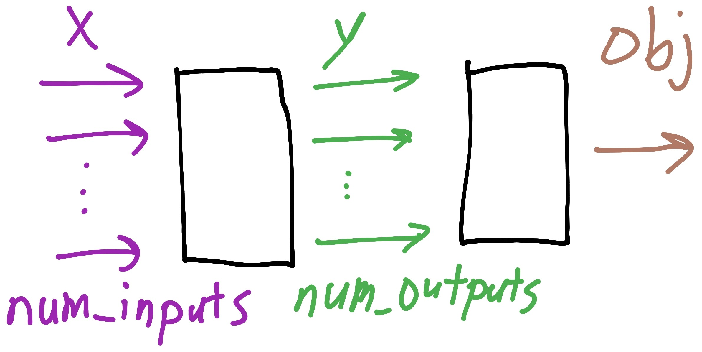
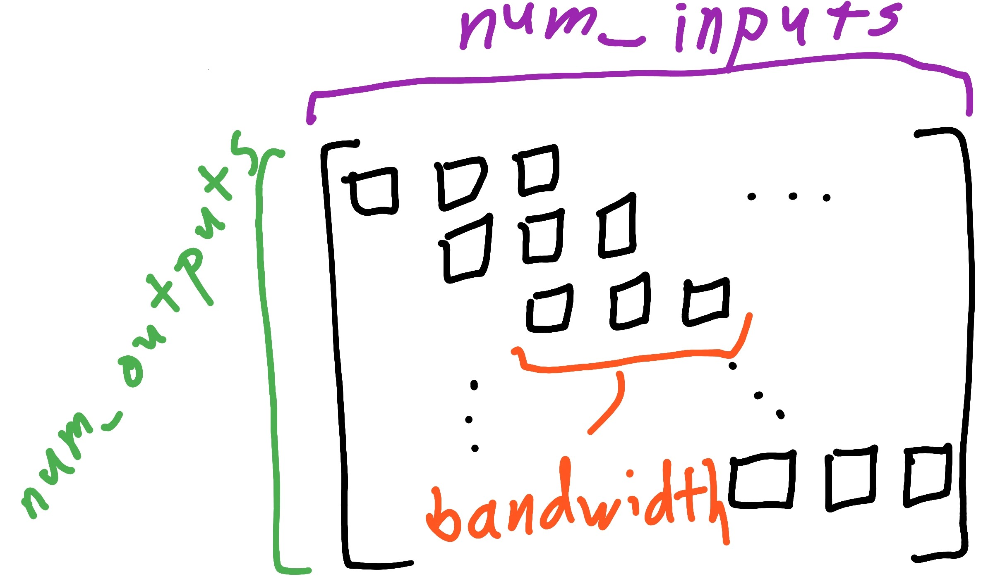
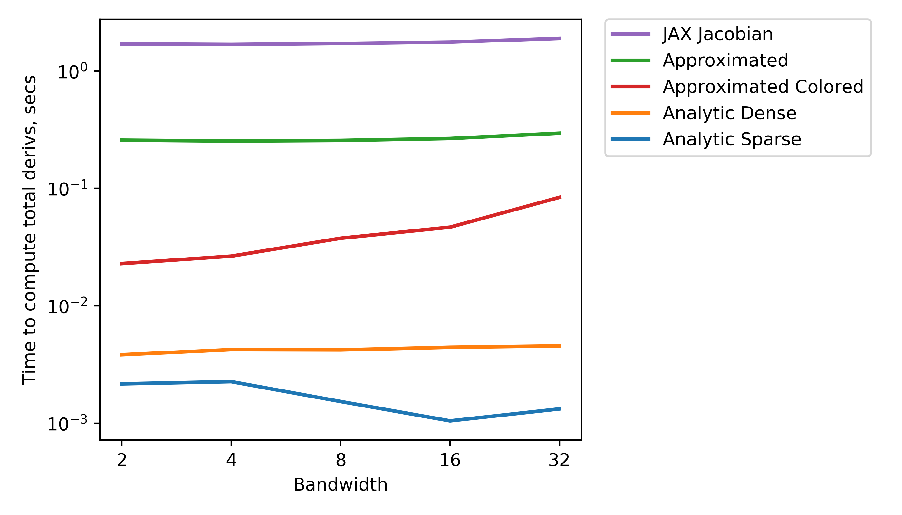
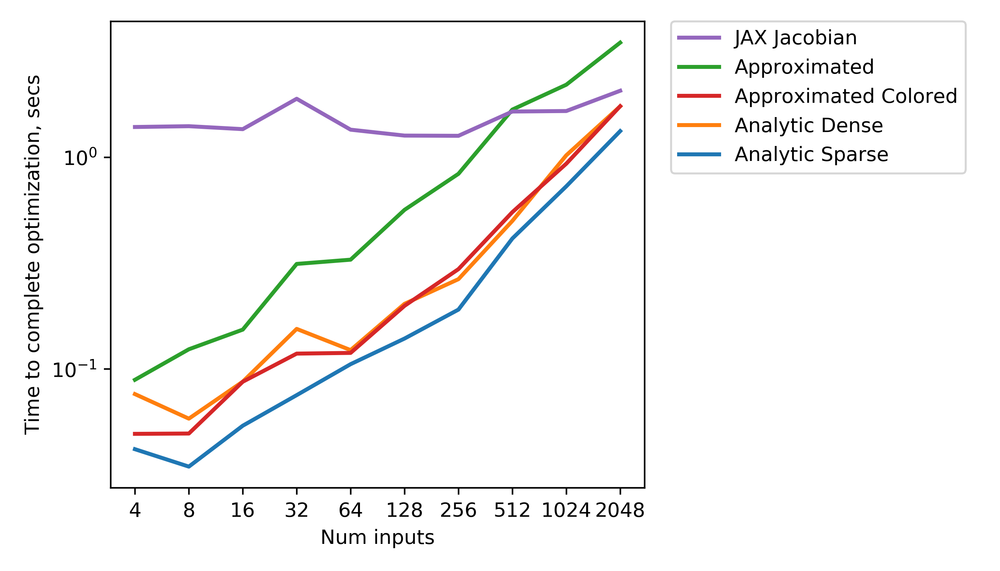
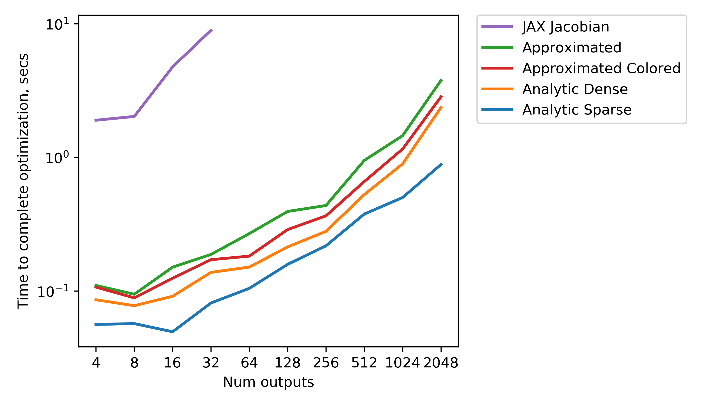
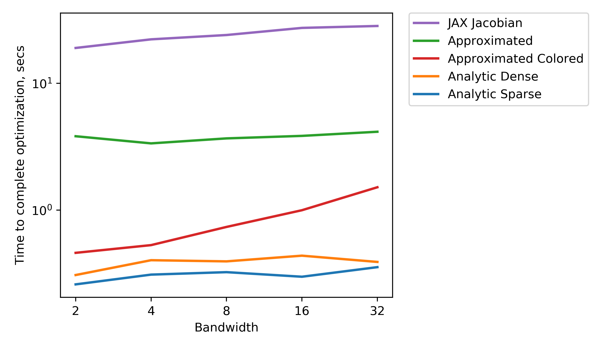

# Background

## Motivation and Aims
Large portions of [WISDEM](https://github.com/WISDEM/wisdem) lack efficient derivative calculations, which would speed up gradient-based optimization.
This short comparison study aims to benchmark derivative computation methods that are relevant to WISDEM to determine their feasibility and utility.

## Context
There are a few ways to efficiently compute derivatives:
- Analytic expressions, by hand
- Automatic differentiation (AD), by computer, either via source code transformation or operator overloading
- Parallel complex step with coloring, to decrease the total amount of calls to the derivative approximation method
It's unclear which method will be the fastest, both in terms of dev and computational time.

The [OpenMDAO](https://github.com/OpenMDAO/OpenMDAO/) and [FLORIS](https://github.com/NREL/floris) dev teams have previously looked into multiple AD options.
Here's a quick summary of what they found:
- [Tangent](https://github.com/google/tangent) : Source code transformation, so it produces human-readable Python for both the forward and reverse modes. However, it's missing quite a few numpy functions and most of the compute functions would need to be rewritten to be compatible; perhaps majorly rewritten.
- [JAX](https://github.com/google/jax) ([Autograd](https://github.com/HIPS/autograd)) : FLORIS team had good results with Autograd, though they had to carefully write their code to be compliant. They're currently adapting FLORIS to work with JAX. One concern with this method for WISDEM would be how much we'd need to rewrite existing `compute` functions.
- [Parallel CS with coloring](http://openmdao.org/twodocs/versions/3.0.0/features/experimental/simul_coloring_fd_cs.html) : This is natively built into OpenMDAO, currently as an experimental feature because not many outside users have provided input to the API. It'd take less `compute` function rewriting than the previous two methods. The computations would have to be complex-safe. Depending on the size of the inputs and outputs, this may be slower computationally than the first two methods.
- [Sympy](https://www.sympy.org/en/index.html) : Symbolically differentiate compute functions. This works for relatively simple computations without large vectors. It's generally more computationally expensive due to the symbolic math library and takes a good amount of rewriting the `compute` function. I wouldn't recommend this, as-is.

## Action plan
1. Create a simple representative system in OpenMDAO, maybe as simple as using the existing Sellar problem.
2. Vectorize this system so the size of the optimization problem can easily be scaled.
3. Create different versions of this system, with derivatives computed by hand, JAX, naive partials FD, naive totals FD, totals CS w/ coloring, and parallel CS w/ coloring to start.
4. Perform multiple optimizations using these different methods across a range of problem sizes.
5. Produce comparison visualizations for each of the different methods and write up a conclusions summary.
6. (stretch goal if warranted) Add Sympy and Tangent as two other methods to compare.

## Expected costs and outcomes
Approximately 12-16 work-hours to complete.

The naive FD/CS methods will be quick to implement and provide reasonable performance, with coloring greatly increasing speed.
JAX will require some work to format the function calls correctly, but will provide a good speedup.
Analytic by hand will be the fastest computationally, but challenging to generalize.
Approx_totals with coloring might be the fastest for some cases, depending on the scaling.

This study should inform the use of certain methods for WISDEM derivative development. A mix of methods will most likely be optimal.

# Problem setup and results

## Problem setup

To compare these derivative computation methods, we need a representative system implemented in OpenMDAO.
This system should be easily scalable so we can see how problem size affects computation cost.
Using an existing subsystem from WISDEM would be the most representative, but few of those are easily scalable and differentiable.

Instead, we use a straightforward system that consists of two components, shown schematically in the first image below.
The first component takes in a vector `x` and performs a simple multiplication and summation to produce the vector `y`.
We can control the size of `x` and the size of `y` using `num_inputs` and `num_outputs`, respectively.
The second component in this system simply takes `y` and sums all values in the array to produce a scalar quantity, `obj`.
This mimics the subsystems in WISDEM that produce the objective quantity, whatever that is.

The Jacobian of the first component, the array of derivatives of the outputs with respect to the inputs, is shown in the figure below.
We can control the size, shape, and sparsity of the Jacobian by changing the values for `num_inputs`, `num_outputs`, and `bandwidth`.
`bandwidth` changes how many of the `x` values are used to produce one entry in the `y` array.
We can see how different derivative computation methods scale by changing the Jacobian sparsity.

## Results

## Future work

